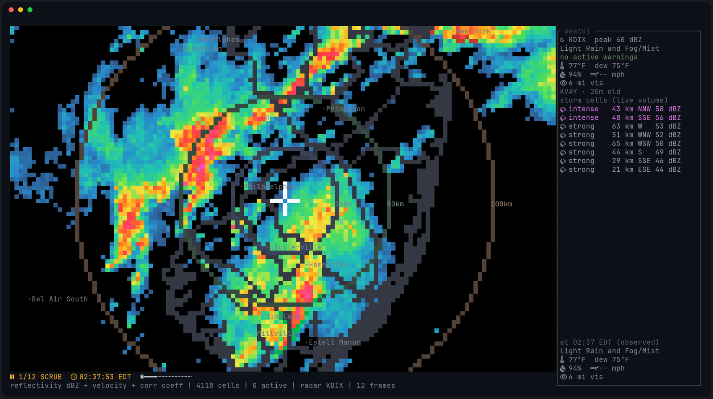
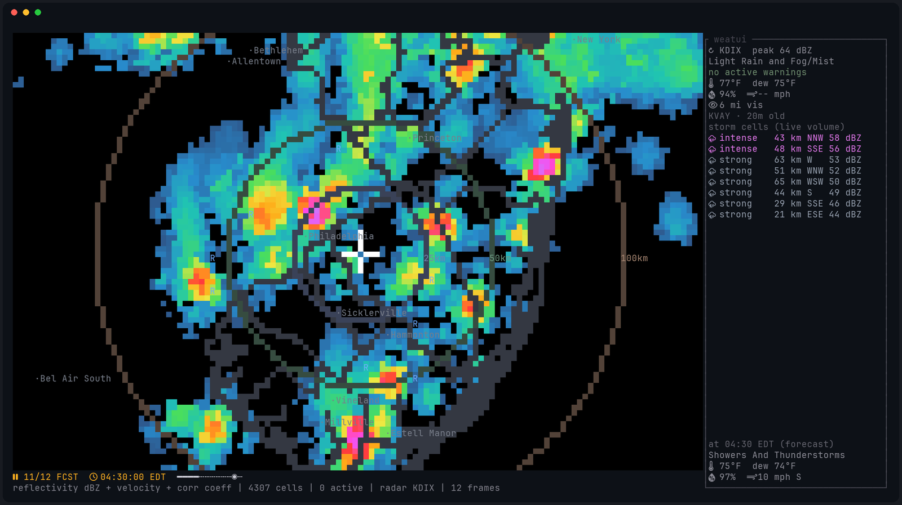
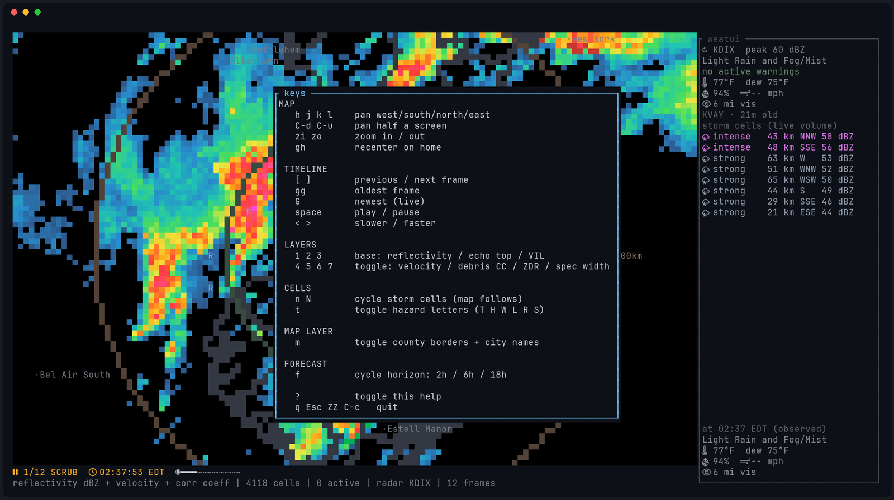

# weatui

A terminal weather radar and severe-weather alerting application: live NEXRAD
Level II radar, HRRR forecast frames, and desktop notifications for warnings
that can kill you. Truecolor TUI, vim keys.



*Live composite reflectivity from KPAH with distance rings, the home
crosshair, and current surface conditions in the HUD.*

## What it does

- **Live radar**: NEXRAD Level II volumes from the NOAA realtime feed,
  rendered at full resolution as half-block pixels (two independently
  coloured pixels per terminal cell), with dual-polarization clutter
  filtering.
- **Forecast radar**: HRRR simulated composite reflectivity (`REFC`),
  on the same timeline as the observed history. Hourly steps are
  motion-interpolated to 15-minute fill frames, and playback dwell scales
  with each frame's time step, so the loop advances at a steady rate.
- **Severe weather alerts**: polls api.weather.gov every few seconds,
  classifies by P-VTEC into lethal / severe / watch tiers, draws warning
  polygons on the map, estimates time-of-arrival from the storm motion
  vector, and pushes desktop notifications.
- **Current conditions**: temperature, dew point, humidity, wind,
  visibility and precipitation from the nearest NWS observation station,
  refreshed every five minutes.



*A forecast frame (`FCST` in the timeline): HRRR's prediction for 90 minutes
from now.*

## Install

Requirements:

- A truecolor terminal (kitty, alacritty, wezterm, foot, ghostty…)
- A [Nerd Font](https://www.nerdfonts.com/) for the HUD glyphs
- `notify-send` (libnotify) with any notification daemon (mako, dunst,
  swaync) for desktop alerts
- Rust ≥ 1.85, or Nix

With Nix (the repo pins the toolchain via `flake.nix`):

```sh
git clone https://github.com/agrathwohl/weatui
cd weatui
nix develop -c cargo build --release
./target/release/weatui
```

With a plain Rust toolchain:

```sh
cargo build --release
```

No system libraries are needed: nothing links OpenSSL, GRIB2 decoding is
pure Rust, and the map projection is hand-rolled.

## Configure

`~/.config/weatui/config.toml` (honours `XDG_CONFIG_HOME`). The minimum is a
location:

```toml
[location]
zip = "37025"        # US ZIP code, resolved offline from embedded centroids
# or exact coordinates, which win over zip when both are present:
# lat = 35.9527
# lon = -87.3085
```

Everything else has defaults:

```toml
[radar]
site = "auto"        # nearest WSR-88D, or force one: "KOHX"
frames = 4           # observed history volumes (~15 min); raise for longer loops
refresh_secs = 60    # radar poll cadence

[alerts]
poll_interval_secs = 5      # api.weather.gov advertises max-age=4
stale_after_secs = 300      # feed-dead watchdog threshold
extra_events = ["Special Weather Statement"]  # non-VTEC products to accept

[alerts.tiers]              # P-VTEC phenomenon.significance codes
lethal = ["TO.W", "EW.W", "FF.W"]   # tornado, extreme wind, flash flood warnings
severe = ["SV.W", "SQ.W", "DS.W"]   # severe thunderstorm, squall, dust storm
watch  = ["TO.A", "SV.A"]           # tornado / severe thunderstorm watches

[alerts.notify]             # notify-send urgency per tier:
lethal = "critical"         #   none / low / normal / critical
severe = "critical"         #   "none" silences the desktop daemon for that
watch  = "normal"           #   tier (e.g. to run only a script instead)

[alerts.scripts]            # absolute path of an executable to run when an
# lethal = "/home/you/bin/siren.sh"      # alert of that tier fires, in
# severe = "/home/you/bin/log-alert.sh"  # addition to the notification (or
# watch  = "/home/you/bin/log-alert.sh"  # instead, with notify = "none")

[render]
colormap = "threat"  # "threat" (high-contrast), "nws" (classic), "mono"
cold_below_f = 32.0  # temperatures at/below render blue in the HUD
hot_above_f = 95.0   # temperatures at/above render red
map = true           # county borders + city names on the radar view
labels = true        # hazard letters beside storm cells
ring_km = [25.0, 50.0, 100.0]  # distance ring radii from home
```

## Run

```sh
weatui        # interactive radar + alerting TUI
weatui -d     # headless daemon: notifications only, no UI
```

## Keys



*The `?` overlay over a forecast frame. The yellow patch is the storm core
HRRR predicts.*

| | |
|---|---|
| `h` `j` `k` `l` | pan west / south / north / east |
| `C-d` `C-u` | pan half a screen |
| `zi` `zo` | zoom in / out |
| `gh` | recenter on home |
| `[` `]` | previous / next frame |
| `gg` / `G` | oldest frame / newest (follow live) |
| `space` | play / pause the loop |
| `<` `>` | slower / faster playback |
| `1` `2` `3` | base layer: reflectivity / echo top / VIL |
| `4` `5` `6` `7` | toggle augmentation: velocity / debris (CC) / ZDR / spectrum width |
| `m` | toggle the map layer (county borders, city names) |
| `t` | toggle hazard letters on storm cells |
| `f` | forecast horizon: +2 h (15-min steps) / +6 h / +18 h |
| `?` | help overlay |
| `q` `Esc` `ZZ` `C-c` | quit |

### Layers

**Base layers** (`1`–`3`): reflectivity, echo top, and vertically
integrated liquid, each with an observed (NEXRAD) and forecast (HRRR) form.

**Augmentations** (`4`–`7`): velocity (rotation), correlation coefficient
(lofted debris), differential reflectivity (hail), and spectrum width
(turbulence), painted over the base wherever the reading is diagnostic.
Velocity and debris detection are on by default. Augmentations draw only
inside ≥ 30 dBZ echo and only on observed frames.

**Map layer** (`m`): county borders from api.weather.gov zone geometry
(fetched once per state, cached on disk) and city names from the embedded
Census places gazetteer.

**Hazard letters** (`t`): each storm cell is tagged with the hazards its
diagnostics support. `T` tornado (rotation or debris), `H` hail, `W`
damaging wind (radial velocity at the severe gust criterion), `L` lightning
(deep-updraft proxy), `R` rain, `S` snow (rain with a freezing surface
temperature).

## Notifications

Alerting works in both modes (`weatui` and `weatui -d`) and shells out to
`notify-send`, so it plugs into whatever notification daemon you already
run and styles with the urgency levels you have already configured (for
example mako's `[urgency=critical]` section):

- New warnings fire once, at the urgency configured for their tier.
  Summary `[LETHAL] Tornado Warning`; body with the NWS headline, the area,
  and an arrival estimate from the storm motion vector.
- Notification text is plain ASCII, so it renders in any daemon's font.
- Each tier can also run a **custom script** (`[alerts.scripts]`): the
  executable is spawned with the tier and event as arguments and the full
  alert in its environment: `WEATUI_TIER`, `WEATUI_EVENT`,
  `WEATUI_HEADLINE`, `WEATUI_AREA`, `WEATUI_ETA_MINUTES`. Scripts run in
  addition to the desktop notification, or instead of it when the tier's
  notify level is `"none"`. Script and notification failures are
  independent.
- If no poll of api.weather.gov has succeeded for `stale_after_secs`, a
  critical **ALERT FEED STALE** notification fires.

Only life-safety products are alerted: tornado, extreme wind, flash flood,
severe thunderstorm, squall and dust storm warnings, tornado and severe
thunderstorm watches, and Special Weather Statements. Air quality, heat,
marine and surf products are out of scope.

## Data sources

| What | Where |
|---|---|
| Live radar | NEXRAD Level II realtime chunks (AWS Open Data) |
| Radar history | NEXRAD Level II archive |
| Forecast radar | HRRR `wrfsubhf` sub-hourly GRIB2, byte-ranged via `.idx` (AWS Open Data) |
| Alerts | api.weather.gov CAP/GeoJSON |
| Conditions | api.weather.gov station observations |
| Geocoding | embedded Census ZCTA centroids (offline) |
| Timezone | api.weather.gov points; times display in the watched location's zone |

All US-government sources; no API keys required.
